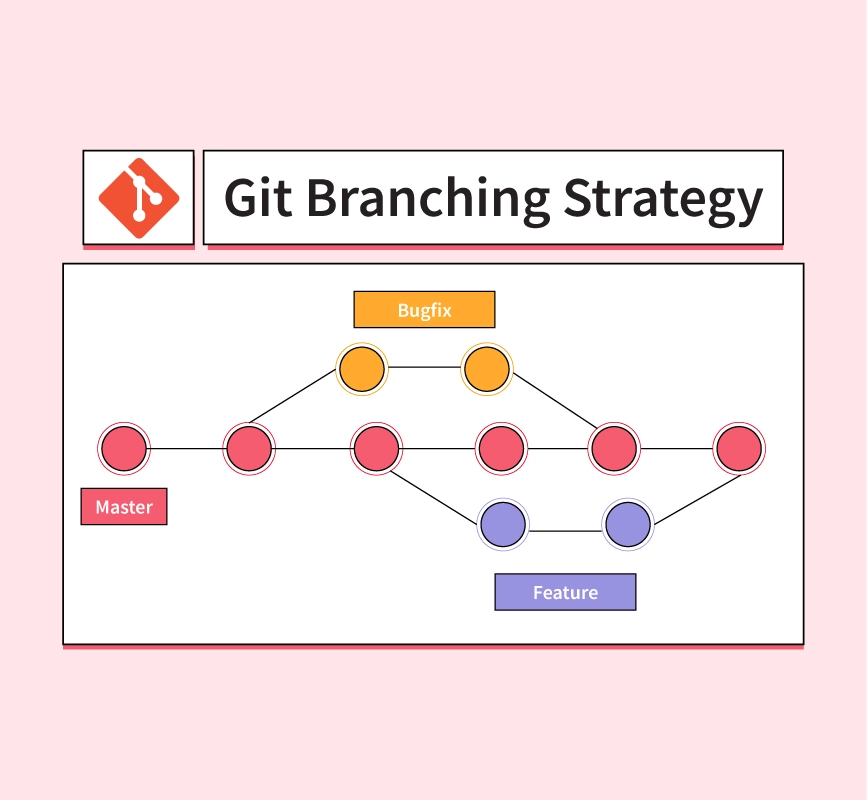

**Git branch**

A branch in Git is a snapshot of your project's history at a particular point in time. You can create multiple branches to work on different features or bug fixes without affecting the main codebase. When you're finished working on a branch, you can merge it back into the main codebase.

**Git merge**

A merge is the process of combining two or more branches into a single branch. When you merge two branches, Git tries to automatically resolve any conflicts that arise. If Git can't resolve a conflict, you'll need to manually resolve it before the merge can be completed.

**Git conflict**

A conflict occurs when two branches have made changes to the same file in different ways. Git can't automatically resolve these conflicts, so you need to manually decide which changes to keep and which changes to discard.

**Here is an example of how branches and merges work:**

1. You create a new branch called `new-feature` to work on a new feature.
2. You make some changes to the codebase on the `new-feature` branch.
3. You decide that your feature is finished, so you merge the `new-feature` branch back into the main codebase.
4. Git tries to automatically resolve any conflicts that arise.
5. If Git can't resolve a conflict, you'll need to manually resolve it before the merge can be completed.
6. Once you've resolved any conflicts, Git will merge the two branches and your new feature will be available in the main codebase.

**Here are some tips for avoiding conflicts:**

* Use descriptive branch names. This will help you to keep track of which branch you're working on and what changes you're making.
* Make small, incremental changes. This will make it easier to resolve conflicts if they do arise.
* Use a merge tool. A merge tool can help you to visually see and resolve conflicts.

**Overall, branches and merges are powerful tools that can help you to organize your work and collaborate with others on Git projects. By understanding how branches and merges work, you can avoid conflicts and keep your codebase clean.**